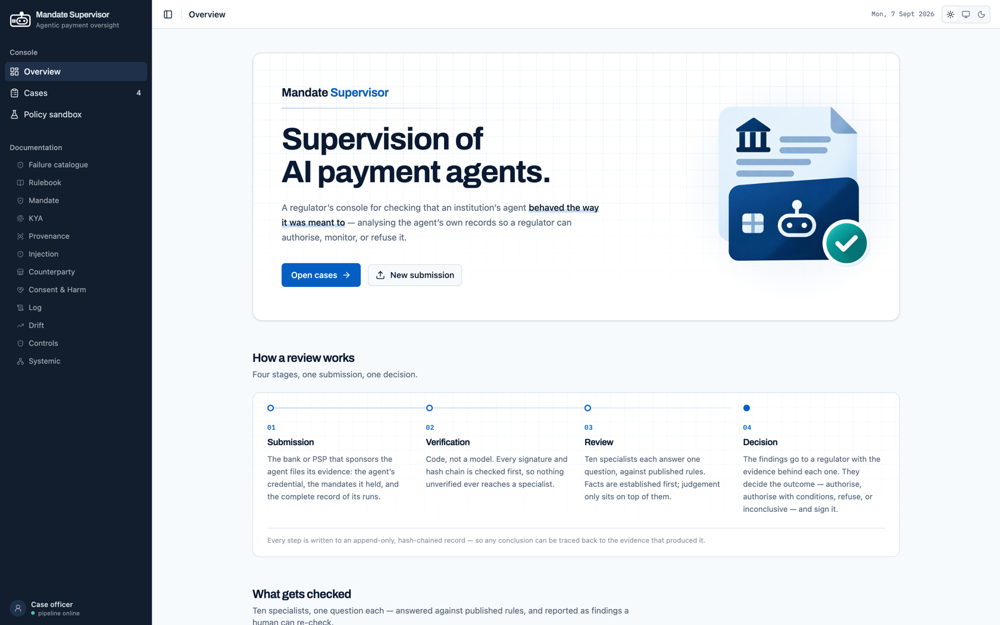
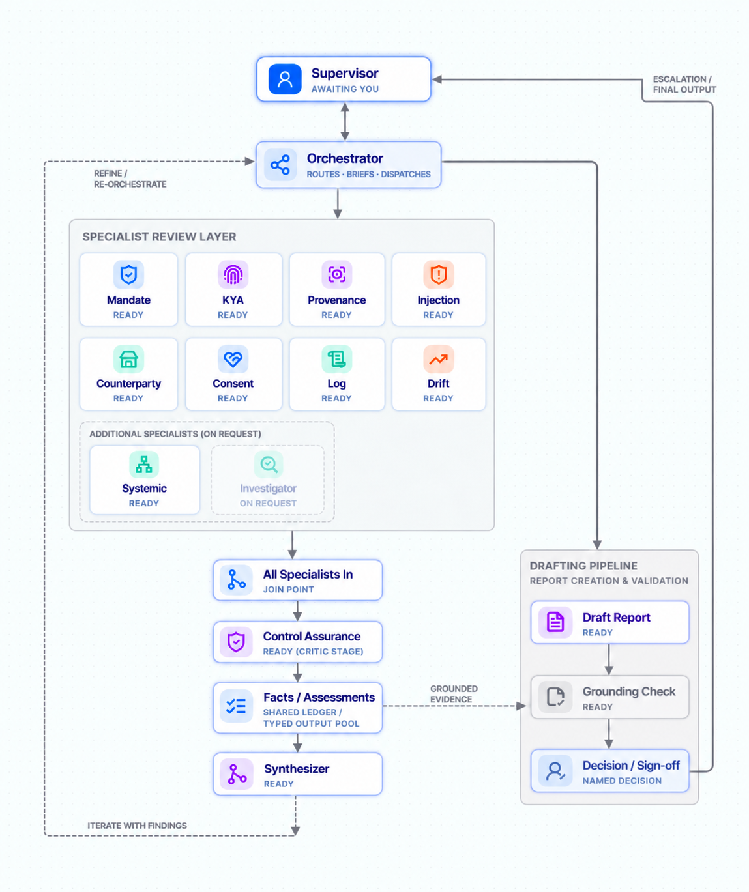
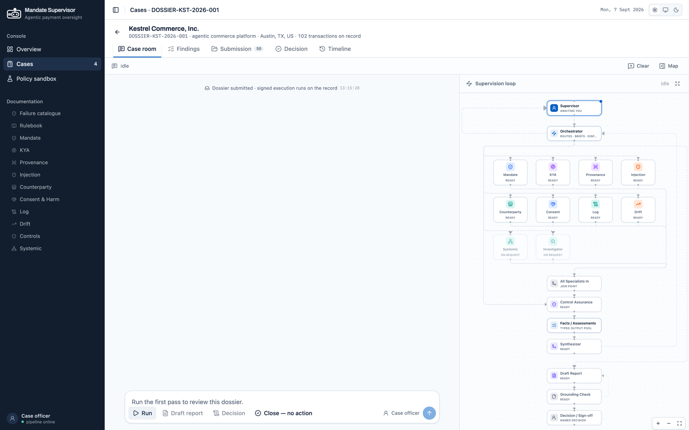
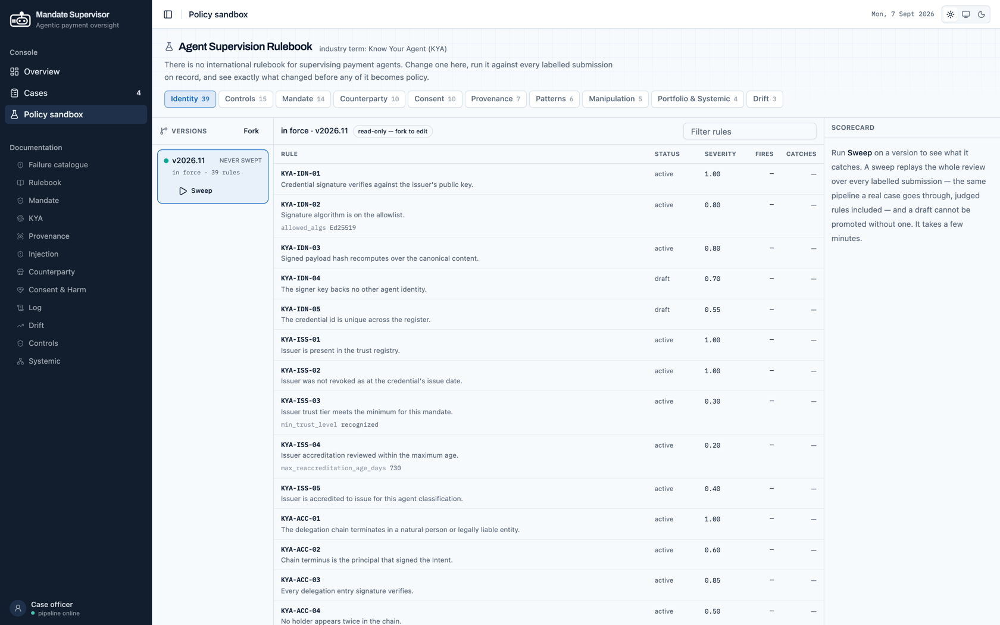

# Mandate Supervisor

**A regulator's console for supervising AI payment agents.**

[](https://www.python.org)
[](#built-with)
[](#built-with)
[](#built-with)
[](https://www.anthropic.com)
[](#what-it-does)
[](#how-its-deployed)
[](LICENSE)

A multi-agent system reviews whether an agent behaved as it was authorised to —
helping a regulator **authorise, monitor or refuse** it — while a **policy
sandbox** tests candidate rules against real evidence before they apply.

[The idea](#the-idea) · [What it does](#what-it-does) · [Policy sandbox](#the-policy-sandbox) · [Built with](#built-with) · [Run it](#run-it) · [Deployment](#how-its-deployed) · [Docs](#documentation)

<sub>Built for NBG's submission to the C:\>DIR Global "Agentic Regulator" Hackathon</sub>


<sub><i>The console — a supervisor's queue, the review, and the rulebooks behind it.</i></sub>

---

## The idea

Payments moved from *click to pay* to **decide to pay**. An AI payment agent is
given a budget and a purpose, then decides for itself when to spend, how much,
and with whom. Supervising a click is straightforward — it is a discrete, logged
action. Supervising a **decision** is not: the agent read something, chose
between options, built a cart, and had it signed.

Google's AP2 binds each purchase to a recorded consent with signed mandates, and
this system verifies that chain with real cryptography. It is still not enough:

> [!IMPORTANT]
> ### Valid signatures do not prove the decision was sound.
>
> A signature is the *output* of a decision, and the published attacks target the
> decision — so a signature-only filing structurally cannot contain the evidence.

Prompt-inject an agent while it assembles the cart and you get a perfectly valid,
correctly signed mandate for a purchase the user never authorised. Every
credential checks out.

So the supervisory question is not *"was this transaction handled correctly?"*
but *"was this decision within what was authorised, by an agent whose authority
traces to a named human?"* — which is why a submission here is a **dossier**, not
a mandate chain.

<table>
<tr><td width="50%" valign="top">

**We supervise the agent, not the firm.**
Two agents at the same institution behave completely differently; a firm-level
score averages away the signal that matters.

</td><td width="50%" valign="top">

**The institution files, not the operator.**
Agent operators are not regulated entities anywhere, so the obligation has to
attach inside the perimeter.

</td></tr>
</table>

---

## What it does

A supervised institution files a dossier about one agent. Deterministic intake
verifies every signature, hash link and file digest — **no model touches an
unparsed submission.** Ten specialists then each answer one supervisory
question, each owning exactly one versioned rulebook.



<sub><i>Supervisor and orchestrator on top; the ten specialists in the review
layer; the join, control assurance and synthesizer down the middle; the drafting
pipeline and named sign-off on the right. Every fact, assessment, dispatch and
decision is appended to the hash-chained ledger as it is produced.</i></sub>

The console renders that same pipeline live, generated from LangGraph's own
graph rather than drawn by hand:


<sub><i>The supervision loop, rendered live from LangGraph's own graph — the ten specialists, the join, and the human gate.</i></sub>

The review ends in one of four dispositions:

| | Meaning |
|:--|:--|
|  | The agent operated within its mandate on the evidence filed |
|  | Authorised with conditions — remediation and a fresh dossier required |
|  | A hard gate tripped, or weighed risk crossed the threshold |
|  | Too thin or too old to decide — so *"we couldn't tell"* can never masquerade as *"it's fine"* |

<details>
<summary><b>The ten specialists</b> — one question, one rulebook each</summary>

<br/>

| | Specialist | Question it answers |
|---|---|---|
| A1 | **Mandate** | Was this within what the human signed? |
| A2 | **KYA** | Does authority trace to a human? |
| B1 | **Provenance** | Were the inputs trustworthy? |
| B2 | **Injection** | Was the agent manipulated, and through which channel? |
| C1 | **Counterparty** | Who received this money? |
| C2 | **Consent & Harm** | Was the human there, and is the consumer worse off? |
| D1 | **Log** | What does the history reveal — structuring, concentration? |
| D2 | **Drift** | What changed, and when did it start? |
| E1 | **Control Assurance** | Did the firm's own controls work? |
| E2 | **Systemic** | What is true of the population that no single firm can see? |

The 10 rulebooks map **1:1** onto the 10 specialists, so "one agent, one domain,
one book" is a property of the code rather than a claim about it.

</details>

**We defined what "wrong" means before writing any of it.** Rather than pointing
a model at a submission and asking whether anything looks off, the failure modes
were catalogued and turned into rulebooks first — so a failed check names the
harm, not just the rule.

That is what keeps the AI's role small and checkable. **If code can do it, code
does it**, and the model has exactly three jobs: decide the rules that genuinely
need judgement, explain over already-computed facts, and flag what the rules do
not cover — as *observations*, which by construction cannot move the score. It is
never asked "is anything wrong here?"; it is asked one named question, from one
rule, and it cannot invent a new kind of finding because the vocabulary of
findings is not its to write.

---

## The policy sandbox

Setting the rules is half the problem, so the system does both halves. Fork the
book in force, edit a draft, and sweep it across the whole labelled corpus —
precision, recall, false positives on known-clean runs, and **which dispositions
flipped**. Only then promote it, human-gated, recorded with the `sweep_id` the
decision rested on.


<sub><i>Every rule with its status, severity and what it fires on — forkable, sweepable, promotable.</i></sub>

---

## Built with

**Core**&nbsp;


**Console**&nbsp;


**Delivery**&nbsp;


Every piece is open and self-hostable. The only external service is the
Anthropic API — and the system degrades to its deterministic floor without it.

---

## Run it

You need [Docker](https://docs.docker.com/get-started/get-docker/). Nothing else
— no Python, no Node. The images are prebuilt.

```bash
curl -O https://raw.githubusercontent.com/Sandro-Gogaladze/Mandate-Supervisor/main/compose.yml
echo "ANTHROPIC_API_KEY=sk-ant-..." > .env
docker compose up -d
```

Open **http://localhost:5173**. The queue is already populated — the corpus is
baked into the image and seeded on first boot.

> [!TIP]
> **Without an API key it still runs.** Every deterministic check works:
> signature and delegation-chain verification, mandate scope and caps,
> structuring and counterparty clustering, control posture, and all of scoring.
> Only the judgement and narration layer is skipped, and it says so rather than
> failing. Nothing here ships a key.

```bash
docker compose logs -f     # follow all three services
docker compose down        # stop, keep the ledger
docker compose down -v     # stop and erase all state
```

Building from source, the dev loop and the test suite:
[docs/development.md](docs/development.md).

---

## How it's deployed

Nothing is compiled on a user's machine. Pushing a version tag builds three
images in GitHub Actions and publishes them to **GHCR**; `compose.yml` pulls
those.

| Image | What it runs |
|---|---|
| `mandate-supervisor-api` | FastAPI, the LangGraph pipeline, the specialists, the ledger |
| `mandate-supervisor-runtime` | CopilotKit ⇄ AG-UI translator. No model, no business logic |
| `mandate-supervisor-dashboard` | nginx serving the console and proxying both backends |

All three build for **linux/amd64 and linux/arm64**, so they run natively on
Apple Silicon rather than crawling under emulation.

```bash
git tag v1.1.0 && git push origin v1.1.0    # → CI builds and publishes
```

<details>
<summary>Release details, state and offline install</summary>

<br/>

- Tags publish as `{version}`, `{major}.{minor}` and `latest`. Commits without a
  tag publish nothing. Auth uses the workflow's own `GITHUB_TOKEN` — no secret to
  create.
- `compose.yml` is served from `main`, so a fix to it reaches downloaders without
  cutting a release. Pin `TAG=1.0.0` for a demo that will not move.
- **State** lives in three Docker volumes — `state` (ledger + sandbox databases),
  `uploads`, `drafts`. They survive `docker compose down`, erased by `down -v`.
- **Offline:** `make save` writes all three images to one tarball, `make load`
  installs them where there is no network.
- GHCR packages are private by default. After the first release set all three to
  public, or every downloader needs a `docker login`.

</details>

---

## Repository structure

```
mandate-supervisor/
├── schemas/      Typed vocabulary — dossiers, facts, assessments, findings, events
├── data/         Synthetic corpus, Ed25519 keystore, regulator-held registers
├── ingestion/    Deterministic verification of signatures, chains, digests. No model
├── registry/     Rules as data — 10 rulebooks, failure catalogue, scoring, policy
├── agents/       10 specialists + orchestrator, critic, synthesizer, drafting, grounding
├── pipeline/     LangGraph graphs, state, scoring, the authorisation decision
├── ledger/       Append-only SQLite, SHA-256 hash chain, independent verifier
├── sandbox/      Draft → sweep → diff → promote
├── api/          FastAPI: queue, case detail, review actions, streaming, sandbox
├── dashboard/    React + Vite + Tailwind + shadcn/ui + React Flow + CopilotKit
├── eval/         Precision and recall against the corpus answer keys
├── tests/        490 tests
└── docs/         The documents linked below
```

Three containers behind nginx on one port, so the whole application is
same-origin:

```
browser :5173 ── nginx ─┬─ /            static console
                        ├─ /api/        FastAPI + LangGraph + ledger  :8123
                        └─ /copilotkit  CopilotKit ⇄ AG-UI runtime    :4000
```

---

## Scale


Counted from this repository on 2026-09-07.

| | |
|---|---|
| **Specialists** | **10**, each owning one supervisory question and one rulebook |
| **Rulebooks** | **113** rules across **10** books — 84 deterministic, 15 AI-judged, 14 on an older shape |
| **Taxonomy** | **102** named failure modes across 8 lifecycle phases, each with a stable id |
| **Corpus** | **4** dossiers · **143** runs · **289** transactions |
| **Labelled ground truth** | **42** planted defects across **30** runs; the other **113** are labelled clean |
| **Tests** | **490** — 489 passed on the last full run (13m46s) |

---

## Built to change

Nothing here is welded shut. The system was built on the assumption that a
supervisor will want to change the rules, the thresholds, the model and the
jurisdiction — so every one of those is a configuration surface rather than a
code change.

| What you can change | How | Without touching |
|---|---|---|
| **The rules** | Edit a versioned JSON rulebook; fork, sweep, promote in the sandbox | Any Python |
| **The thresholds** | 24 rules carry tunable `params`; the authorisation policy is its own versioned file | Any agent code |
| **The failure catalogue** | `registry/failures.json` is data, with stable ids rules point at | The detection layer |
| **The jurisdiction** | Load your own rulebooks and catalogue and you have your own regime | Anything at all |
| **A specialist** | Every agent returns the same typed `Fact` / `Assessment` / `Finding`, so one can be swapped, added or removed behind that contract | Its ten peers |
| **The model** | Tier and reasoning budget are environment variables; the deterministic floor runs with no model at all | The pipeline |
| **The scoring** | Weights come from the ruleset; the scorer is a pure function of findings | The decision path |

**Rules as data is the load-bearing choice.** A threshold compiled into Python
cannot be drafted, swept, diffed or promoted — and a regulator who cannot test a
rule against evidence before publishing it is guessing. Everything else follows
from keeping policy out of the code.

The same discipline runs through the interfaces: typed records at every boundary,
a deterministic core with judgement contained to named points, and an
orchestrator that composes specialists rather than hard-wiring them. That is what
makes the next rulebook, the next specialist or the next jurisdiction an
addition rather than a rewrite.

### Notes on the current build

- **The corpus is synthetic**, by design — there is no live rail access. What is
  synthetic is the evidence, not the logic.
- **The authorisation policy is a prototype** and versioned as one
  (`2026.09.prototype.1`), so calibrating it is a data change, not a code change.
- **The corpus exercises the `authorisation` filing purpose.** Renewal, periodic
  supervision and incident are supported by the schema and ready to be exercised.
- **The test suite is not hermetic** — 490 tests, 489 passing on the last full
  run; it needs an `ANTHROPIC_API_KEY` and network and takes ~14 minutes.

---

## Documentation

| | |
|---|---|
| [**Supervision model**](docs/supervision-model.md) | Who files what, the full data contract, the rulebooks, the ten specialists, the sandbox |
| [**Architecture**](docs/architecture.md) | How a review runs node by node, the graphs, the loops, and why this shape |
| [**Guardrails**](docs/guardrails.md) | Human-in-the-loop, auditability, governance, cyber risk — and the code enforcing each |
| [**Development**](docs/development.md) | Running from source, the test suite, configuration, releasing |
| [Concept note](docs/concept-note.md) | The submission as filed, August 2026. **History, not design** — it describes microservices and four specialists; both were superseded |

---

<sub>Released under the [MIT Licence](LICENSE) · Built for NBG's submission to the C:\>DIR Global "Agentic Regulator" Hackathon</sub>
